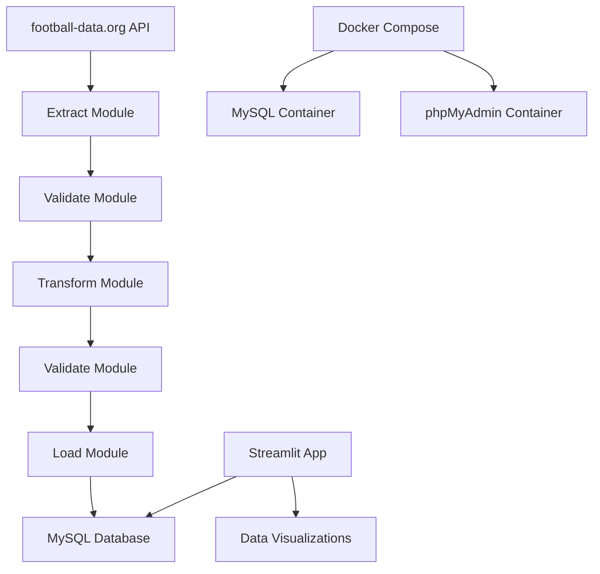

# Football Data Pipeline

A comprehensive ETL pipeline for fetching, processing, and visualizing Premier League football data using Python, MySQL, and Streamlit.

## Architecture



## Project Structure

```
├── src/
│   ├── extract.py      # API data extraction
│   ├── transform.py    # Data processing and cleaning
│   ├── validate.py     # Data validation and quality checks
│   └── load.py         # Database operations
├── tests/              # Unit and integration tests
├── docker-compose.yml  # MySQL and phpMyAdmin containers
├── .env.example        # Environment variables template
├── requirements.txt    # Python dependencies
├── main.py            # ETL pipeline orchestrator
├── app.py             # Streamlit web application
└── README.md          # This file
```

## Features

- **Extract**: Fetch live Premier League standings from football-data.org API
- **Transform**: Process and clean raw API data into structured format
- **Validate**: Ensure data quality and integrity
- **Load**: Store data in MySQL database with proper indexing
- **Visualize**: Interactive Streamlit dashboard with charts and tables

## Setup

1. **Clone the repository**
   ```bash
   git clone <repository-url>
   cd football-data-pipeline
   ```

2. **Set up environment**
   ```bash
   # Copy environment template
   cp .env.example .env

   # Edit .env with your API key and database credentials
   nano .env
   ```

3. **Start MySQL database**
   ```bash
   # Using Docker Compose
   docker-compose up -d

   # Or install MySQL locally and create database
   ```

4. **Install dependencies**
   ```bash
   pip install -r requirements.txt
   ```

5. **Run the pipeline**
   ```bash
   python main.py
   ```

6. **Launch the dashboard**
   ```bash
   streamlit run app.py
   ```

## API Key

Get your free API key from [football-data.org](https://www.football-data.org/client/home).

## Database Schema

### premier_league_standings_tbl
- position (INT, PRIMARY KEY)
- team (VARCHAR(255))
- games_played (INT)
- wins (INT)
- draws (INT)
- losses (INT)
- goals_for (INT)
- goals_against (INT)
- goal_difference (INT)
- points (INT)

### premier_league_standings_vw
Database view with proper ranking based on points, goal difference, and goals scored.

## Testing

```bash
# Run all tests
python -m pytest tests/

# Run with coverage
python -m pytest --cov=src tests/
```

## Docker

The project includes Docker Compose configuration for easy database setup:

- MySQL 8.0 database
- phpMyAdmin for database management
- Persistent data volumes

```bash
# Start services
docker-compose up -d

# Stop services
docker-compose down

# View logs
docker-compose logs -f mysql
```

## Contributing

1. Fork the repository
2. Create a feature branch
3. Make your changes
4. Add tests
5. Submit a pull request

## License

MIT License - see LICENSE file for details.