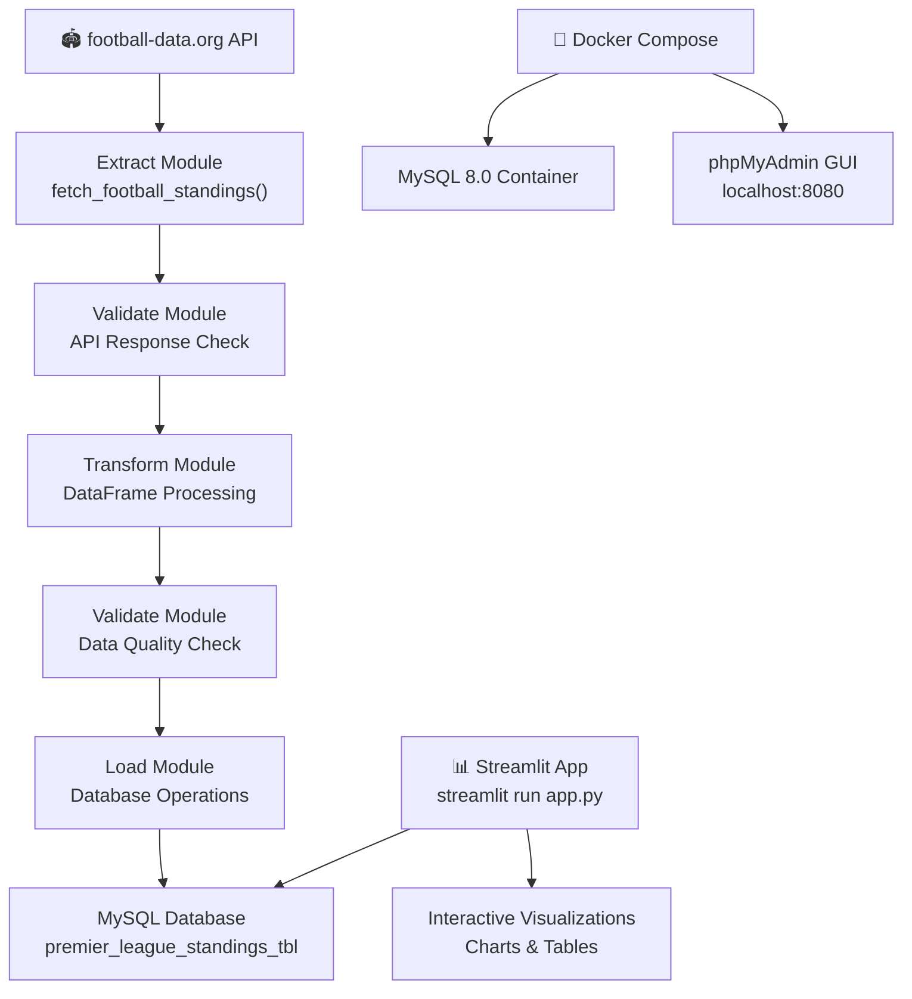

# Football Data Pipeline

A comprehensive ETL (Extract-Transform-Load) pipeline for fetching, processing, and visualizing Premier League football data. Built with Python, MySQL, and Streamlit for production-ready data engineering workflows.

## Overview

This project demonstrates a professional data engineering pipeline that:
- Fetches live Premier League standings from an external API
- Validates data at multiple stages for quality assurance
- Transforms raw data into a structured relational format
- Loads clean data into a MySQL database
- Serves an interactive web dashboard for data exploration

Perfect for portfolio projects, learning data engineering, or as a foundation for sports analytics applications.

## Architecture



## Project Structure

```
python_sql_football_data_pipeline/
├── src/                           # Core pipeline modules
│   ├── extract.py                # fetch_football_standings() - API data fetching
│   ├── transform.py              # process_standings_data() - DataFrame transformation
│   ├── validate.py               # Data quality validation functions
│   └── load.py                   # Database operations & connection handling
│
├── tests/                         # Unit and integration tests (pytest)
│   ├── test_extract.py
│   ├── test_transform.py
│   ├── test_load.py
│   └── test_validate.py
│
├── assets/                        # Static files
│   └── premier-league-logo.png
│
├── main.py                        # ETL orchestrator (runs pipeline end-to-end)
├── app.py                         # Streamlit web application (dashboard)
├── docker-compose.yml             # MySQL 8.0 + phpMyAdmin containers
├── requirements.txt               # Python package dependencies
├── .env.example                   # Environment variables template
├── .env                           # Actual environment (git-ignored)
├── football_table_standings.log   # Pipeline execution logs
├── README.md                      # This file
└── .git/                          # Version control
```

## Running the Pipeline

### Run Full ETL Pipeline

Executes all stages: Extract → Validate → Transform → Validate → Load

```bash
python main.py
```

**Output:**
- Console logging of each stage
- Database populated with standings
- Log file: `football_table_standings.log`
- Sample output:
  ```
  2026-04-13 02:15:01 - __main__ - INFO - Starting Football Data Pipeline
  2026-04-13 02:15:01 - __main__ - INFO - Step 1: Extracting data
  2026-04-13 02:15:02 - __main__ - INFO - Step 2: Transforming data
  2026-04-13 02:15:02 - __main__ - INFO - Step 3: Loading data to database
  2026-04-13 02:15:03 - __main__ - INFO - Pipeline completed successfully
  ```

### Launch Web Dashboard

**IMPORTANT:** Always use `streamlit run`, NOT `python app.py`

```bash
streamlit run app.py
```

**Access the dashboard:**
- Open browser to: `http://localhost:8501`
- Interactive table showing Premier League standings
- Toggle button to show/hide bar chart visualization
- Responsive layout with Premier League logo

### Database Management

**View database with phpMyAdmin:**
```
URL: http://localhost:8080
Username: root
Password: (from .env MYSQL_PASSWORD)
```

**Query standings directly:**
```bash
mysql -u root -p football_db
SELECT * FROM premier_league_standings_vw ORDER BY position;
```

## Features

### Core Pipeline
- ✅ **Extract**: Fetches live Premier League standings from football-data.org REST API with retry logic
- ✅ **Validate (Pre-Transform)**: Validates API response structure and data completeness
- ✅ **Transform**: Converts raw JSON data into structured Pandas DataFrames with proper schema
- ✅ **Validate (Post-Transform)**: Ensures data quality, type safety, and business rule compliance
- ✅ **Load**: Intelligently inserts or updates records in MySQL using `ON DUPLICATE KEY UPDATE`

### Database Layer
- ✅ **Ranked Views**: Window function-based database views for automatic ranking
- ✅ **Schema Management**: Clean relational schema with proper data types and constraints
- ✅ **Error Handling**: Comprehensive logging for all database operations

### Visualization
- ✅ **Interactive Dashboard**: Real-time standings table with Streamlit
- ✅ **Dynamic Charts**: Plotly-based bar charts showing points distribution
- ✅ **Radio Controls**: Toggle between table and visualization views
- ✅ **Responsive Layout**: Wide layout with logo display and instructions

### Development & Testing
- ✅ **Unit Tests**: pytest-based test suite for core modules
- ✅ **Docker Support**: Docker Compose for isolated MySQL environment
- ✅ **Environment Management**: `.env` configuration for secure credential handling
- ✅ **Logging**: Comprehensive logging to file and console

## Quick Start (5 minutes)

### Prerequisites
- Python 3.8+
- Git
- Docker & Docker Compose (optional, or use local MySQL)
- API key from [football-data.org](https://www.football-data.org/client/home) (free tier available)

### Minimal Setup

```bash
# 1. Clone and enter project
git clone <repository-url>
cd python_sql_football_data_pipeline

# 2. Create Python virtual environment
python -m venv .venv
source .venv/bin/activate  # On Windows: .venv\Scripts\activate

# 3. Install dependencies
pip install -r requirements.txt

# 4. Start Docker database (or set up MySQL locally)
docker-compose up -d

# 5. Configure environment
cp .env.example .env
# Edit .env and add your API_KEY from football-data.org

# 6. Run ETL pipeline
python main.py

# 7. Launch dashboard (opens browser automatically)
streamlit run app.py
# Navigate to: http://localhost:8501
```

## Detailed Setup

### 1. Environment Configuration

Create a `.env` file in the project root:

```bash
cp .env.example .env
```

Edit `.env` with your credentials:

```env
# API Configuration
API_KEY=your_api_key_from_football_data_org
API_HOST=api.football-data.org
LEAGUE_ID=PL
SEASON=2023

# Database Configuration
MYSQL_HOST=localhost
MYSQL_PORT=3306
MYSQL_DATABASE=football_db
MYSQL_USERNAME=root
MYSQL_PASSWORD=your_password

# File Paths
IMAGE_FILE_PATH=assets/premier-league-logo.png
```

**Get an API Key:**
1. Visit [football-data.org](https://www.football-data.org/client/home)
2. Sign up for a free account
3. Copy your API key from the dashboard

### 2. Start MySQL Database

**Option A: Using Docker Compose (Recommended)**
```bash
docker-compose up -d
# MySQL: localhost:3306
# phpMyAdmin: localhost:8080 (user: root, password from .env)
```

**Option B: Using Local MySQL**
```bash
mysql -u root -p
CREATE DATABASE football_db;
```

### 3. Install Python Dependencies

```bash
python -m venv .venv
source .venv/bin/activate  # Windows: .venv\Scripts\activate
pip install -r requirements.txt
```

## Database Schema

### Table: `premier_league_standings_tbl`

Core table storing standings data:

| Column | Type | Description |
|--------|------|-------------|
| `position` | INT (PRIMARY KEY) | Table position (1-20) |
| `team` | VARCHAR(255) | Team name |
| `games_played` | INT | Matches played |
| `wins` | INT | Matches won |
| `draws` | INT | Matches drawn |
| `losses` | INT | Matches lost |
| `goals_for` | INT | Goals scored |
| `goals_against` | INT | Goals conceded |
| `goal_difference` | INT | GF - GA |
| `points` | INT | Total points |

**SQL:**
```sql
CREATE TABLE premier_league_standings_tbl (
    position INT PRIMARY KEY,
    team VARCHAR(255),
    games_played INT,
    wins INT,
    draws INT,
    losses INT,
    goals_for INT,
    goals_against INT,
    goal_difference INT,
    points INT
);
```

### View: `premier_league_standings_vw`

Auto-ranked view using MySQL window functions:

```sql
CREATE VIEW premier_league_standings_vw AS
SELECT
    ROW_NUMBER() OVER (
        ORDER BY points DESC, goal_difference DESC, goals_for DESC
    ) AS position,
    team,
    games_played,
    wins,
    draws,
    losses,
    goals_for,
    goals_against,
    goal_difference,
    points
FROM premier_league_standings_tbl;
```

**Ranking Logic:** Points DESC → Goal Difference DESC → Goals For DESC

## Testing

### Run All Tests

```bash
pytest tests/ -v
```

### Run with Coverage

```bash
pytest --cov=src tests/ --cov-report=html
```

### Available Test Suites

- `test_extract.py` - API fetching and error handling
- `test_transform.py` - Data transformation logic
- `test_validate.py` - Data quality checks
- `test_load.py` - Database operations

### Example Test Run

```bash
$ pytest tests/ -v
tests/test_extract.py::test_fetch_football_standings PASSED      [ 20%]
tests/test_transform.py::test_process_standings_data PASSED      [ 40%]
tests/test_validate.py::test_validate_api_response PASSED        [ 60%]
tests/test_load.py::test_create_standings_table PASSED           [ 80%]
tests/test_load.py::test_load_standings_data PASSED              [100%]
```

## Docker & Containerization

### Start Services

```bash
docker-compose up -d
```

This starts:
- **MySQL 8.0** on `localhost:3306`
- **phpMyAdmin** on `localhost:8080` (user: `root`)
- Persistent data volume: `mysql_data`

### Stop Services

```bash
docker-compose down
```

### View Logs

```bash
# MySQL logs
docker-compose logs -f mysql

# All services
docker-compose logs -f
```

### Database Backup

```bash
docker-compose exec mysql mysqldump -u root -p football_db > backup.sql
```

### Cleanup (WARNING: Deletes Database)

```bash
docker-compose down -v  # Removes volumes too
```

## Technology Stack

| Component | Technology | Version |
|-----------|-----------|---------|
| **Language** | Python | 3.8+ |
| **Web Framework** | Streamlit | Latest |
| **Data Processing** | Pandas | Latest |
| **Visualization** | Plotly Express | Latest |
| **Database** | MySQL | 8.0 |
| **ORM/Query Library** | PyMySQL | Latest |
| **Testing** | pytest | Latest |
| **API Client** | requests | Latest |
| **Environment** | python-dotenv | Latest |
| **Containerization** | Docker & Compose | Latest |

## Troubleshooting

### Problem: `ModuleNotFoundError: No module named 'src'`

**Solution:**
```bash
# Make sure virtual environment is activated
source .venv/bin/activate  # Mac/Linux
.venv\Scripts\activate     # Windows

# Reinstall dependencies
pip install -r requirements.txt
```

### Problem: `Can't connect to MySQL server`

**Check:**
1. MySQL container is running: `docker ps`
2. Credentials in `.env` match environment
3. Port 3306 is not blocked by firewall

**Restart Docker:**
```bash
docker-compose down
docker-compose up -d
```

### Problem: `Streamlit warnings about ScriptRunContext`

**This is normal!** When you run `streamlit run app.py`, these warnings can be safely ignored. They occur in bare mode.

**Never use:** `python app.py` (use `streamlit run app.py` instead)

### Problem: API Rate Limiting

**Solution:**
- The free tier has ~10 requests/minute
- Add delays between runs in `extract.py`
- Or upgrade your API plan at football-data.org

### Problem: `FileNotFoundError: assets/premier-league-logo.png`

**Solution:**
1. Add a logo image to `assets/premier-league-logo.png`
2. Or the app will display a warning and continue without it

## Common Commands

```bash
# Activate virtual environment
source .venv/bin/activate

# Run full pipeline
python main.py

# Launch dashboard
streamlit run app.py

# Run tests
pytest tests/ -v

# Database operations
mysql -u root -p football_db

# View logs
tail -f football_table_standings.log

# Docker management
docker-compose up -d
docker-compose down
docker-compose logs -f
```

## Portfolio & Learning Value

### Skills Demonstrated

This project showcases:
- ✅ **Data Engineering**: Full ETL pipeline design and implementation
- ✅ **API Integration**: REST API consumption with error handling
- ✅ **Database Design**: Relational schema with views and constraints
- ✅ **Data Quality**: Multi-stage validation and cleansing
- ✅ **Web Development**: Interactive dashboard with Streamlit
- ✅ **Testing**: Comprehensive unit and integration tests
- ✅ **DevOps**: Docker containerization and environment management
- ✅ **Python Best Practices**: Modular code, logging, error handling
- ✅ **SQL**: Queries, views, window functions, indexes

### Use Cases

1. **Learning Tool**: Understand ETL fundamentals
2. **Portfolio Project**: Demonstrate data engineering skills
3. **Foundation**: Extend with more sports/data sources
4. **Interview Prep**: Discuss architecture & implementation decisions
5. **Production Template**: Adapt for real-world data pipelines

## Contributing

We welcome contributions! Here's how:

1. **Fork the repository**
   ```bash
   git fork https://github.com/user/python_sql_football_data_pipeline
   ```

2. **Create a feature branch**
   ```bash
   git checkout -b feature/my-feature
   ```

3. **Make your changes**
   ```bash
   # Edit files, run tests
   pytest tests/ -v
   ```

4. **Commit and push**
   ```bash
   git add .
   git commit -m "Add my feature"
   git push origin feature/my-feature
   ```

5. **Open a Pull Request**
   - Describe changes clearly
   - Include tests for new features
   - Ensure all tests pass

## Future Enhancements

Potential features to add:
- [ ] Historical data tracking (season comparisons)
- [ ] Advanced analytics (form trends, predictions)
- [ ] Multi-league support (Europe's top 5 leagues)
- [ ] Real-time notifications (significant events)
- [ ] API endpoint for external consumers
- [ ] Machine learning predictions
- [ ] Data quality metrics dashboard
- [ ] Incremental loading (avoid re-fetching all data)

## Frequently Asked Questions

**Q: How often does the data update?**
A: Run `python main.py` as a cron job or scheduled task. Currently manual but can be automated.

**Q: Can I use this with other sports?**
A: Yes! Modify `extract.py` to fetch different data sources and adjust schema in `load.py`.

**Q: Is this production-ready?**
A: This is a learning/portfolio project. For production, add monitoring, error alerts, and data backups.

**Q: Do I need Docker?**
A: No, you can use a local MySQL installation. Docker Compose is just more convenient.

**Q: How do I add more data?**
A: Extend the schema in `load.py`/database, update extraction in `extract.py`, and modify the dashboard in `app.py`.

## Resources & References

- [football-data.org API Documentation](https://www.football-data.org/documentation/api)
- [Streamlit Documentation](https://docs.streamlit.io/)
- [MySQL Window Functions](https://dev.mysql.com/doc/refman/8.0/en/window-functions.html)
- [Pandas Documentation](https://pandas.pydata.org/docs/)
- [pytest Documentation](https://docs.pytest.org/)